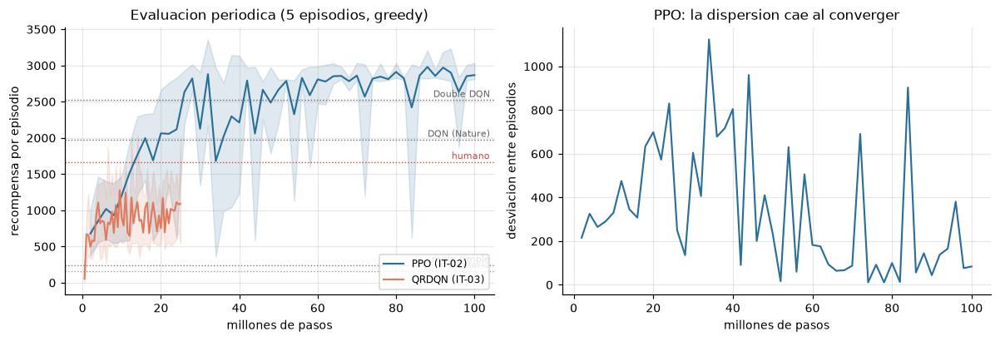
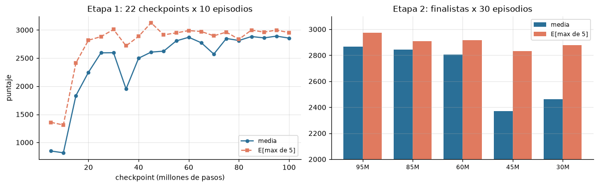
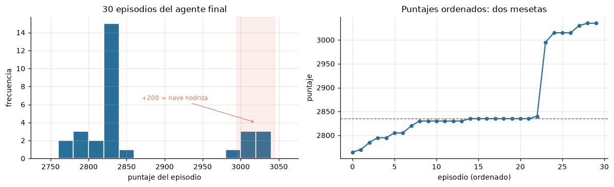
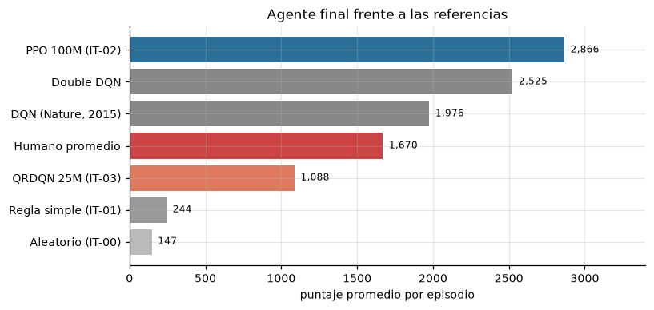

# Proyecto 2 — Competencia de Agentes en Space Invaders

**Curso:** CC3092 Deep Learning y Sistemas Inteligentes
**Entorno:** `ALE/SpaceInvaders-v5` (Gymnasium + ale-py)
**Algoritmo final:** PPO (Proximal Policy Optimization)
**Puntaje de evaluación:** 2866 de media sobre 30 episodios, máximo 3035

---

## 1. Definición del problema y análisis del entorno

### 1.1 El entorno

`ALE/SpaceInvaders-v5` expone el juego Atari 2600 *Space Invaders* a través del
Arcade Learning Environment. El agente controla un cañón que se desplaza
horizontalmente en la base de la pantalla y debe destruir una formación de 36
invasores que avanzan en zigzag mientras descienden, esquivando sus proyectiles y
usando tres búnkeres como cobertura.

**Estructura de recompensa.** Cada invasor destruido otorga puntos según la fila que
ocupa: 5, 10, 15, 20, 25 y 30 puntos de la fila inferior a la superior. Limpiar una
formación completa suma 630 puntos y genera una nueva, más rápida y más baja. La
nave nodriza (UFO) que cruza ocasionalmente por la parte superior vale 200 puntos.
ALE define la recompensa como el incremento del marcador del juego entre pasos.

**Terminación.** El episodio termina (`terminated=True`) cuando el agente pierde sus
tres vidas o cuando los invasores alcanzan la base. El `truncated=True` corresponde
al límite de 108,000 frames del entorno (27,000 decisiones con salto de 4), que en la
práctica nunca se alcanza: los episodios del agente final duran entre 1,894 y 2,145
pasos.

**Vidas.** El agente dispone de tres vidas. Perder una no genera recompensa negativa;
sólo acorta el episodio al acercar su final.

### 1.2 Espacio de observación y de acción

| | Forma | Tamaño |
|---|---|---|
| Imagen RGB (default) | `Box(0,255,(210,160,3),uint8)` | 100,800 valores |
| RAM | `Box(0,255,(128,),uint8)` | 128 valores |

Se utilizó la **observación visual RGB**, preprocesada a escala de grises 84×84 y
apilada en grupos de 4 frames, resultando en tensores `(4,84,84)` de tipo `uint8`
(28,224 valores, una reducción de 3.6× respecto al frame RGB original).

Se descartó la observación de RAM: aunque es 787 veces más compacta, sus 128 bytes
carecen de semántica documentada, son específicos de cada juego y no permiten
reutilizar arquitecturas convolucionales estándar ni comparar con la literatura.

El **espacio de acción es `Discrete(6)`**, el conjunto mínimo del juego:

| Índice | Acción | Efecto |
|---|---|---|
| 0 | `NOOP` | no hacer nada |
| 1 | `FIRE` | disparar |
| 2 | `RIGHT` | mover a la derecha |
| 3 | `LEFT` | mover a la izquierda |
| 4 | `RIGHTFIRE` | mover a la derecha y disparar |
| 5 | `LEFTFIRE` | mover a la izquierda y disparar |

### 1.3 Análisis empírico de la señal de recompensa

En lugar de asumir si la recompensa es densa o dispersa, se midió sobre 2,928 pasos
de cinco episodios con política aleatoria en el entorno de evaluación:

| Métrica | Valor |
|---|---|
| Pasos con recompensa distinta de cero | **1.95%** (uno cada ~51 decisiones) |
| Valores observados | 5, 10, 15, 20, 25, 30, 200 |
| Recompensa media por paso | 0.360 |
| Recompensa máxima en un paso | 200 |
| Recompensas negativas | ninguna |

**La señal es dispersa.** Además, presenta una fuerte asimetría de magnitudes: un
acierto a la nave nodriza (200 puntos) equivale a **40 invasores de la fila
inferior** (5 puntos). Esta asimetría, y no la dispersión, es lo que determina las
decisiones de diseño.

**Decisiones derivadas del análisis:**

- **Reward clipping a `sign(r)` durante el entrenamiento.** Sin recortar, el error
  temporal-diferencia producido por un UFO es cuarenta veces el de un invasor común,
  lo que desequilibra la magnitud del gradiente entre transiciones que representan
  logros comparables en términos de política. El puntaje se reporta siempre crudo en
  el entorno de evaluación.
- **No se aplicó reward shaping.** Con una recompensa cada ~51 pasos, un episodio
  completo acumula decenas de señales, suficiente para aprender sin recompensas
  artificiales. El resultado final (2866 puntos) confirma que no era
  necesario.
- **Conjunto mínimo de 6 acciones en vez de `full_action_space` (18).** Las 18
  combinaciones del joystick incluyen direcciones verticales que no tienen efecto en
  este juego, donde el cañón sólo se desplaza horizontalmente. Un espacio de acción
  mayor diluye la exploración sin agregar comportamiento alcanzable.
- **Sticky actions activadas (`repeat_action_probability=0.25`).** Es el valor por
  defecto de la versión v5 y el que estará presente en la evaluación de la
  competencia. Entrenar sin ellas habría introducido un desajuste entre las
  condiciones de entrenamiento y las de evaluación.
- **Manejo de vidas asimétrico y deliberado.** Durante el entrenamiento cada vida
  perdida termina el episodio (`terminal_on_life_loss=True`), lo que acorta el
  horizonte de asignación de crédito y acelera el aprendizaje. En evaluación el
  episodio comprende las **tres vidas completas**, que es como se mide el puntaje de
  la competencia.

---

## 2. Metodología de desarrollo

### 2.1 Algoritmos considerados y elección final

Se consideraron las dos familias principales de RL profundo aplicables a Atari:

**Off-policy con replay (DQN, Double DQN, Dueling DQN, QRDQN).** Aprenden una función
de valor Q y derivan la política del argmax. Reutilizan experiencia pasada mediante
un buffer, lo que los hace eficientes en muestras. Su debilidad es la estabilidad: la
red objetivo persigue estimaciones generadas por ella misma, y una sobreestimación
puede propagarse antes de corregirse.

**On-policy con optimización de política (A2C, PPO).** Optimizan la política
directamente. PPO limita el tamaño del paso mediante el *clipping* del cociente de
probabilidades, lo que impide actualizaciones destructivas. Descarta la experiencia
tras cada actualización, siendo menos eficiente en muestras, pero paraleliza de forma
trivial sobre muchos entornos simultáneos.

**Se eligió PPO**, y la decisión se tomó con evidencia propia, no por preferencia. Se
entrenaron ambas familias en paralelo durante la misma noche (IT-02 y IT-03) y el
resultado fue inequívoco: PPO alcanzó 2866 puntos frente a los
1088 de QRDQN, un factor de 2.6×.

Dos razones explican la diferencia bajo las restricciones de este proyecto:

1. **Eficiencia en tiempo de reloj, no en muestras.** El cuello de botella medido no
   fue la GPU sino el paso de simulación de los entornos, que es trabajo de CPU. Con
   16 entornos en paralelo PPO alcanzó 4,321 pasos/s frente a los 800 de QRDQN, que
   es de un solo entorno por su dependencia del buffer. En una ventana fija de
   cómputo, PPO procesó **cuatro veces más experiencia**.
2. **Estabilidad.** QRDQN mostró la inestabilidad característica de los métodos con
   bootstrap: alcanzó 1277 puntos hacia los 9.5M pasos,
   se desplomó a 497 y sólo se recuperó
   parcialmente. PPO subió de forma monótona a lo largo de los 100M pasos.

### 2.2 Arquitectura de la red

Se utilizó la arquitectura convolucional de Mnih et al. (2015), estándar para Atari,
que `CnnPolicy` de Stable-Baselines3 implementa por defecto:

| Capa | Configuración | Salida |
|---|---|---|
| Entrada | observación apilada | `(4, 84, 84)` uint8 |
| Conv 1 | 32 filtros 8×8, paso 4, ReLU | `(32, 20, 20)` |
| Conv 2 | 64 filtros 4×4, paso 2, ReLU | `(64, 9, 9)` |
| Conv 3 | 64 filtros 3×3, paso 1, ReLU | `(64, 7, 7)` |
| Aplanado | | 3,136 |
| Densa | 512 unidades, ReLU | 512 |
| Cabezas | política (6 logits) y valor (1 escalar) | 6 / 1 |

La relación con la observación preprocesada es directa: los pasos grandes de las
primeras convoluciones (4 y 2) reducen agresivamente las dimensiones espaciales
porque la información relevante en Space Invaders —posiciones de sprites— es de baja
frecuencia espacial. La entrada de 4 canales corresponde a los 4 frames apilados, de
modo que los filtros de la primera capa pueden aprender detectores de movimiento
operando sobre el eje temporal. La normalización a [0,1] ocurre dentro de la red, lo
que permite almacenar las observaciones como `uint8` y reducir la memoria 4×.

Política y función de valor comparten el tronco convolucional y se separan sólo en
las cabezas finales, lo que reduce parámetros y actúa como regularización.

### 2.3 Estrategia de exploración vs. explotación

PPO no usa ε-greedy. La exploración surge de que la política es **estocástica**: en
entrenamiento las acciones se muestrean de la distribución categórica que produce la
red. El término de entropía en la función objetivo (`ent_coef = 0.01`) penaliza que
esa distribución se concentre prematuramente, manteniendo exploración activa sin
necesidad de un parámetro decreciente programado a mano.

El equilibrio se desplaza hacia la explotación de forma **emergente**: a medida que
la política mejora, la ventaja estimada favorece acciones concretas y la entropía cae
por sí sola. Esto contrasta con ε-greedy en QRDQN, donde el calendario
(`exploration_fraction = 0.025`, ε final 0.01) se fija de antemano sin conocer la
velocidad de aprendizaje real.

En **evaluación** se usa política determinista (argmax). Se verificó empíricamente
que es la elección correcta: ver sección 4.3.

### 2.4 Hiperparámetros

Punto de partida: la configuración de RL Baselines3 Zoo para Atari, con una
desviación justificada por medición (`n_envs`).

| Parámetro | Valor | Justificación |
|---|---|---|
| Entornos paralelos | **16** | RL-Zoo usa 8; se midió 1,977 pasos/s con 8 y 4,321 con 16 en esta máquina (32 hilos) |
| `n_steps` | 128 | rollout de 128×16 = 2,048 transiciones por actualización |
| `batch_size` | 256 | 8 minilotes por rollout |
| `n_epochs` | 4 | pasadas sobre cada rollout |
| Optimizador | Adam | |
| `learning_rate` | 2.5e-4 con decaimiento lineal a 0 | |
| `clip_range` | 0.1 con decaimiento lineal | limita el paso de política |
| `ent_coef` | 0.01 | bonificación de entropía |
| `vf_coef` | 0.5 | peso de la pérdida de valor |
| `gamma` | 0.99 | factor de descuento |
| `gae_lambda` | 0.95 | compromiso sesgo-varianza en GAE |
| Pérdida | objetivo sustituto recortado + MSE de valor − entropía | |
| Pasos totales | 100,000,000 | ~8 h en RTX 5070 Laptop |

La **función de pérdida** de PPO combina tres términos: el objetivo sustituto
recortado de la política, el error cuadrático de la función de valor (ponderado por
`vf_coef`) y la bonificación de entropía restada (ponderada por `ent_coef`).

Para QRDQN (IT-03): buffer de 100,000 transiciones, `learning_rate` 1e-4, lotes de
32, `learning_starts` 100,000, red objetivo actualizada cada 1,000 pasos, un paso de
gradiente cada 4 transiciones, 200 cuantiles.

### 2.5 Preprocesamiento del entorno

Idéntico en entrenamiento y evaluación salvo dos diferencias deliberadas:

| Wrapper | Entrenamiento | Evaluación | Motivo |
|---|---|---|---|
| `frameskip=1` en el entorno ALE | sí | sí | v5 trae 4 de fábrica y los wrappers aplican otro 4 |
| `repeat_action_probability=0.25` | sí | sí | default de v5, presente en la evaluación real |
| No-ops iniciales (hasta 30) | sí | sí | diversifica el estado inicial |
| Salto de 4 frames con máximo de los 2 últimos | sí | sí | estándar; el máximo corrige el parpadeo del Atari |
| Escala de grises, 84×84 | sí | sí | estándar Nature |
| Apilado de 4 frames | sí | sí | codifica velocidad y dirección |
| **Fin de episodio al perder vida** | **sí** | **no** | acorta el horizonte de crédito al entrenar; en evaluación el episodio son las 3 vidas |
| **Recorte de recompensa a `sign(r)`** | **sí** | **no** | estabiliza el gradiente; el puntaje se reporta crudo |

**Una verificación no obvia resultó crítica.** El entrenamiento usa el entorno
vectorizado de Stable-Baselines3 y la evaluación un entorno Gymnasium simple, para
poder reutilizar `ejecutar_episodio` y `RecordVideo` del Laboratorio 5. Ambas rutas
deben producir observaciones **idénticas**, o el agente jugaría con una entrada
distinta a la que vio entrenando sin que se lance ningún error. Se escribió
`src/verificar_equivalencia.py`, que compara las dos rutas paso a paso con acciones
fijas. La prueba reveló tres discrepancias reales, detalladas en la sección 3.4.

---

## 3. Resultados de iteraciones

### 3.1 Historial de experimentos

| ID | Algoritmo | Cambio respecto a la anterior | Pasos | Eval. media | Máx. |
|---|---|---|---|---|---|
| IT-00 | Aleatorio | línea base, sin entrenamiento | — | 166 ± 103 | 380 |
| IT-01 | Regla simple | alterna `LEFTFIRE`/`RIGHTFIRE` cada 120 frames | — | 245 ± 81 | 380 |
| IT-02 | **PPO** | 16 entornos, `lr` lineal 2.5e-4, 100M pasos | 100M | **2868** | 3035 |
| IT-03 | QRDQN | off-policy distribucional, buffer 100k | 25M | 1088 | 1975 |
| IT-04a | PPO continuado | *(inválida — ver 3.5)* | +60M | 2,829 | 2,840 |
| IT-04b | PPO continuado | `lr` y `clip_range` constantes | +60M | 2853 | 3015 |

Los baselines IT-00 e IT-01 provienen del Laboratorio 5 y se re-midieron sobre el
entorno de evaluación de este proyecto (10 episodios cada uno). Todas las
evaluaciones usan política greedy, las 3 vidas completas y recompensa sin recortar.

### 3.2 Curvas de entrenamiento



PPO progresó de forma sostenida durante los 100M pasos. Por bloques de 20M:

| Bloque | Media | Dispersión entre evaluaciones |
|---|---|---|
| 0–20M | 1,296 | 436 |
| 20–40M | 2,270 | 368 |
| 40–60M | 2,542 | 251 |
| 60–80M | 2,799 | 81 |
| 80–100M | 2,822 | 162 |

Las ganancias se reducen progresivamente (+974, +272, +282, +26), lo que sugiere
convergencia hacia el final del presupuesto de cómputo.

**El indicador más informativo no es la media sino la dispersión.** La desviación
entre episodios cayó de ~600 en los primeros 30M a menos de 100 en los últimos 20M
(panel derecho de la figura). El agente no sólo puntúa más alto: se volvió
**consistente**. Esa caída es la señal de convergencia real, porque una media alta
puede provenir de un episodio afortunado mientras que una dispersión baja no.

QRDQN alcanzó 1277 puntos hacia los 9.5M pasos y luego
se desplomó, recuperándose sólo parcialmente hasta 1088. Esta oscilación es la
inestabilidad esperable de un método off-policy con bootstrap.

### 3.3 Selección del checkpoint: el problema de la métrica

El enunciado se contradice sobre cómo se construye el ranking: la tabla de
información clave y la rúbrica indican "puntaje promedio", mientras que el
procedimiento de la sección 3 indica "se tomará el mayor de esos 5 episodios". Ante
la ambigüedad se evaluaron los checkpoints con **ambos criterios**, calculando
`E[máx de 5]` mediante bootstrap sobre los puntajes observados.

La selección se hizo en dos etapas para no gastar cómputo innecesario:



**Etapa 1** — 22 checkpoints × 10 episodios. **Etapa 2** — los 5 finalistas × 30
episodios con semillas distintas.

| Checkpoint | Etapa 1 media | Etapa 1 E[máx5] | Etapa 2 media | Etapa 2 E[máx5] |
|---|---|---|---|---|
| 95M | 2891 | 2998 | **2866** | **2974** |
| 85M | 2884 | 2999 | **2844** | **2910** |
| 60M | 2870 | 2989 | **2805** | **2917** |
| 45M | 2607 | 3128 | **2370** | **2834** |
| 30M | 2596 | 3009 | **2461** | **2878** |

**Dos resultados metodológicos de esta tabla:**

**(a) Diez episodios no bastan para seleccionar por el máximo.** En la etapa 1 el
checkpoint de 45M lideraba el ranking por `E[máx de 5]` con 3128, por
encima del de 95M. Con 30 episodios cayó a 2834 y su media resultó
2370 con desviación 774: el episodio de 3,515 puntos de la
etapa 1 había sido afortunado, no representativo. Seleccionar con la etapa 1 habría
llevado a la competencia un agente **496 puntos peor** en media.

**(b) El `best_model` de Stable-Baselines3 no era el mejor checkpoint.** Su
`EvalCallback` guarda el modelo según la recompensa media de sólo 5 episodios. Ese
archivo obtuvo 2816 puntos en la etapa 1, fuera de los cinco primeros.
Confiar en él —el comportamiento por defecto— habría costado
50 puntos.

Con 30 episodios, **`paso_95M` gana ambos rankings** (media 2866, `E[máx de
5]` 2974), lo que elimina la necesidad de apostar a una interpretación
del enunciado.

**Etapa 3 — desempate contra los checkpoints de IT-04b.** Aunque IT-04b no mejoró
como entrenamiento (sección 3.5), eso no descartaba que alguno de sus checkpoints
individuales superase al campeón: son preguntas distintas. El filtro sobre sus 14
checkpoints situó a `ultimo.zip` (160M pasos) por encima del campeón en las dos
métricas, con un episodio de **3,230 puntos**, por encima del techo de 3,035 que
hasta entonces parecía estructural.

Con 30 episodios y las mismas semillas que los finalistas de IT-02, la diferencia
resultó ser de +26 puntos en media. Una **prueba de
permutación pareada** (20,000 remuestreos con inversión de signos) dio *p* = 0.29: el
retador ganaba en 16 de 30 episodios y perdía en 11, indistinguible de una moneda.
Su ventaja en `E[máx de 5]` provenía de **un único episodio**: era el solo puntaje
por encima de 3,035 de toda la muestra, mientras que el campeón acumulaba seis
episodios por encima de 3,000 de forma consistente.

Se ejecutó entonces un desempate con **30 semillas completamente nuevas** para ambos:

| Candidato | Media | `E[máx de 5]` | Máximo |
|---|---|---|---|
| `ppo_01/paso_95M` (campeón) | **2858** | **2946** | 3035 |
| `ppo_03/ultimo` (retador) | 2842 | 2913 | 3030 |

El campeón gana ambos rankings y el retador **no reprodujo su episodio de 3,230**
(máximo 3030). Sobre los 60 episodios acumulados de los dos conjuntos de
semillas, las medias son estadísticamente equivalentes, pero el campeón presenta
menor dispersión y un piso más alto (2765 y 2800 frente a
2635 y 2775), lo que reduce el riesgo en una evaluación en vivo
de sólo cinco episodios.

Este desempate es la tercera ocasión en el proyecto en que un candidato lidera una
muestra pequeña y no sobrevive a una mayor. El patrón es sistemático: con
desviaciones de ~100 puntos por episodio, cualquier ventaja inferior a un par de
desviaciones estándar exige decenas de episodios para confirmarse.

### 3.4 Problemas encontrados: tres desajustes silenciosos

La prueba de equivalencia entre la ruta de entrenamiento y la de evaluación
(sección 2.5) detectó tres discrepancias. **Ninguna producía error**: las tres
habrían degradado el desempeño en la evaluación sin ninguna señal visible.

1. **Orden de ejes.** El apilado de SB3 produce `(84,84,4)` con los canales al final
   e inserta internamente una transposición al construir el modelo; el de Gymnasium
   produce `(4,84,84)` directamente. Comparar sin replicar esa transposición daba
   observaciones con los ejes permutados.
2. **Relleno inicial del stack.** Al reiniciar, `VecFrameStack` llena el historial
   con ceros mientras que `FrameStackObservation` repite el primer frame. La
   diferencia afectaba los **tres primeros pasos de cada episodio**, de forma
   permanente. Se corrigió con `padding_type="zero"`.
3. **Acción de reinicio.** Los wrappers de Atari de SB3 aplican `FireResetEnv`
   —que ejecuta **dos** pasos tras el reinicio— cuando `FIRE` está entre las
   acciones. `AtariPreprocessing` de Gymnasium no hace nada equivalente. Se replicó
   explícitamente en la ruta de evaluación.

Tras las correcciones, las dos rutas producen observaciones idénticas byte a byte.

### 3.5 Un experimento inválido detectado por revisión de código

IT-04 se diseñó para responder si el agente había convergido realmente o si
simplemente se había quedado sin tasa de aprendizaje: el `learning_rate` de IT-02
decaía linealmente hasta **cero exactamente en los 100M pasos**, de modo que el
tramo final entrenó con un paso de gradiente despreciable. La continuación debía
usar `learning_rate` constante de 1e-4.

Tras 60M pasos adicionales el resultado fue 2,829 puntos, sin mejora, y se concluyó
que el agente ya había convergido.

**Esa conclusión era falsa.** Una revisión posterior del código reveló que
`Algo.load()` de Stable-Baselines3 restaura los *schedules serializados* del modelo
guardado, y que los hiperparámetros del archivo de configuración sólo se aplicaban
al construir un modelo nuevo. El experimento ignoró su propia configuración:

| Hiperparámetro | Configurado | Real (según el log) |
|---|---|---|
| `learning_rate` | 1.0e-4 constante | 9.37e-05 → **2.8e-09** |
| `clip_range` | — | 0.0375 → **1.12e-06** |

Con `clip_range` en 1e-06 la política era prácticamente incapaz de actualizarse. El
experimento no midió lo que afirmaba medir: **no hubo mejora porque el agente no
entrenó**, no porque no quedara nada que aprender.

Se corrigió aplicando explícitamente los hiperparámetros al modelo cargado e
informando cuáles no son aplicables tras la construcción (como `n_steps`, que
dimensiona el buffer de rollout), y se re-ejecutó el experimento como IT-04b.

**Resultado de la re-ejecución (IT-04b).** Con `learning_rate = 1e-4` y
`clip_range = 0.1` verificados en el registro de entrenamiento, 60M pasos
adicionales produjeron una media de **2821 ± 110** sobre
30 evaluaciones periódicas, frente a 2866 de IT-02 en su tramo
final. La diferencia de -45 puntos **no es distinguible del
ruido**: una prueba de permutación (20,000 remuestreos, sin supuesto de normalidad)
da *p* = 0.31.

La conclusión original —que el agente había convergido a los 100M pasos— resulta
por tanto **correcta, pero por accidente**: se había derivado de un experimento que
no medía lo que afirmaba. Sólo tras la corrección queda respaldada por evidencia
válida.

**La lección es metodológica.** Un experimento de RL puede fallar en silencio y
producir un número perfectamente plausible. El resultado "sin mejora" era creíble y
encajaba con la hipótesis de partida, y precisamente por eso era peligroso: nada
invitaba a sospechar. Sólo una lectura del código lo expuso.

Como observación adicional, durante el seguimiento de IT-04b se repitió el mismo
error de razonamiento en otra forma: con las dos primeras evaluaciones (2,894 y
2,905, ambas por encima de IT-02) parecía haber una mejora. Con 8 evaluaciones la
diferencia se había invertido, y con 30 desapareció. Las ventanas cortas en RL
invitan sistemáticamente a confundir el extremo de un rango con una tendencia.

---

## 4. Discusión de resultados

### 4.1 Qué tuvo mayor impacto

Ordenado por efecto sobre el puntaje final:

**1. La elección de algoritmo (2.6× de diferencia).** PPO frente a
QRDQN produjo la mayor brecha de todo el proyecto. Pero conviene precisar la causa:
la literatura no reporta que PPO supere a los métodos distribucionales en Space
Invaders —de hecho QRDQN suele quedar por encima con presupuestos grandes—. La
ventaja aquí es **específica de la restricción de cómputo**. El cuello de botella
medido fue el paso de simulación en CPU, no la GPU; PPO paraleliza sobre 16 entornos
y procesó 4,321 pasos/s frente a 800 de QRDQN. En una ventana de ocho horas, PPO vio
cuatro veces más experiencia. Con semanas de cómputo la conclusión podría invertirse.

**2. El número de entornos paralelos (2.2× de rendimiento).** Pasar de 8 a 16
entornos subió el ritmo de 1,977 a 4,321 pasos/s, más que el doble esperado. La
razón es que cada llamada a la GPU procesa el lote completo de observaciones: con
más entornos, el coste fijo de lanzar los kernels se amortiza mejor. La GPU estaba al
93% de ocupación pero usando sólo 768 MiB de 8 GB, es decir limitada por latencia de
lanzamiento, no por cómputo.

**3. La selección de checkpoint (50 puntos).** Elegir por
evaluación amplia en lugar del `best_model` por defecto. No cambia el agente
entrenado, pero sí cuál se lleva a competir.

**4. La corrección de los desajustes de preprocesamiento (efecto no cuantificado).**
Los tres bugs de la sección 3.4 se corrigieron antes de entrenar, así que no hay
medición de su impacto. El del relleno del stack habría contaminado los tres primeros
pasos de cada episodio de forma permanente.

Y algo que **no** tuvo impacto: continuar entrenando más allá de los 100M pasos
(IT-04), donde las ganancias por bloque ya habían caído a +26 puntos.

### 4.2 Comportamiento del agente final



La distribución de 30 episodios es **bimodal**, no dispersa:

| Grupo | Episodios | Rango |
|---|---|---|
| Bajo | 23 (77%) | 2765 – 2840 |
| Alto | 7 (23%) | 2995 – 3035 |

No hay ningún episodio entre 2840 y 2995. La correspondencia
entre grupos es exacta valor por valor: cada puntaje del grupo alto equivale a uno del
grupo bajo **más 200** (2835+200=3035, 2830+200=3030, 2795+200=2995), que es
precisamente lo que vale la nave nodriza.

**Interpretación.** El agente no juega mejor o peor según el episodio: ejecuta
esencialmente la misma política todas las veces y alcanza de forma consistente
~2,835 puntos. La variación observada es casi enteramente **acertarle o no al UFO una
vez**. El rango completo de 30 episodios es de apenas 270 puntos
sobre una media de 2866, es decir un 9%.

**Qué aprendió.** Con 630 puntos por formación limpia, 2,835 puntos equivalen a
**4.5 formaciones**: el agente limpia cuatro oleadas completas y muere a mitad de la
quinta. El video muestra la estrategia aprendida: se posiciona en un extremo,
dispara con cadencia alta y se desplaza lateralmente siguiendo la columna de
invasores más cercana, priorizando limpiar columnas completas antes que disparar al
azar. Eso reduce el frente de fuego enemigo.

**Dónde falla.** A partir de la quinta oleada los invasores descienden más rápido y
disparan con mayor frecuencia. La política de barrido lateral deja de ser suficiente
para esquivar y el agente pierde las tres vidas en pocos segundos, casi siempre en el
mismo punto. **No aprendió a usar los búnkeres como refugio**: los atraviesa
disparando, destruyéndolos, en lugar de posicionarse detrás. Tampoco persigue
activamente la nave nodriza; los aciertos parecen incidentales.

**Mejora más rentable identificada.** Priorizar el UFO valdría +200 puntos por
partida de forma sistemática —más que cualquier ajuste de hiperparámetros en este
punto de la convergencia, donde 20M pasos adicionales aportaron 26 puntos.

### 4.3 Exploración vs. explotación

Se midió directamente la hipótesis de que una política estocástica podría convenir si
el ranking se define por el máximo de 5 episodios: al muestrear en lugar de tomar el
argmax aumenta la varianza, y con ella potencialmente el máximo.

| Política | Media | Desv. | Máximo | E[máx de 5] |
|---|---|---|---|---|
| Determinista | **2866** | 87 | 3035 | **2974** |
| Estocástica | 2849 | 103 | 3035 | 2966 |

**La hipótesis quedó refutada.** La varianza sube (87 → 103)
pero el máximo no se mueve y la media baja. La razón es que la distribución de la
política convergida ya está muy concentrada: muestrear de ella produce sobre todo la
misma acción que el argmax, y cuando difiere suele ser un error. Se usa política
determinista.

Durante el entrenamiento el equilibrio se desplazó de forma emergente, sin calendario
programado: la bonificación de entropía mantuvo la exploración mientras la política
era mala, y a medida que la ventaja estimada favoreció acciones concretas, la entropía
cayó por sí sola. Esto contrasta con ε-greedy de QRDQN, cuyo calendario se fija de
antemano sin conocer la velocidad real de aprendizaje.

### 4.4 Limitaciones

**Cómputo y tiempo.** El proyecto se ejecutó en una ventana de aproximadamente 36
horas sobre una GPU de portátil (RTX 5070 Laptop, 8 GB). Los 100M pasos de IT-02
consumieron ~8 horas. Esa restricción determinó la elección de algoritmo (sección
4.1) y limitó el barrido de hiperparámetros: sólo se probó una configuración de PPO,
tomada de RL Baselines3 Zoo, con una única desviación medida (`n_envs`).

**Comparación desigual entre familias.** QRDQN recibió 25M pasos frente a los 100M
de PPO. La comparación es justa en **tiempo de reloj** —ambos corrieron la misma
noche en la misma máquina— pero no en muestras. Con igual número de pasos el
resultado podría diferir.

**Evaluación con pocos episodios durante el entrenamiento.** Las evaluaciones
periódicas usaron 5 episodios, suficiente para ver la tendencia pero no para comparar
checkpoints. La sección 3.3 documenta exactamente ese fallo.

**Una sola semilla.** Todos los entrenamientos usaron la semilla 2026. No se puede
distinguir qué parte del resultado es reproducible y qué parte es específica de esa
inicialización.

**Sin ablaciones de preprocesamiento.** No se midió el efecto de quitar el apilado de
frames, el recorte de recompensa o el fin de episodio por vida. Se adoptaron por ser
estándar en la literatura, no por evidencia propia.

**Deuda técnica en la reanudación de entrenamientos.** Revisiones de código
posteriores identificaron tres defectos en la bandera `--resume` que no llegaron a
afectar ningún resultado, porque ningún entrenamiento se interrumpió: (a)
Stable-Baselines3 interpreta `total_timesteps` como pasos *adicionales* y no como
objetivo final, de modo que reanudar un run caído entrenaría de más; (b) al aplicar
los hiperparámetros del archivo de configuración sobre un modelo ya cargado, el
valor `train_freq` se asigna como entero sobre el objeto que SB3 construye
internamente, lo que haría fallar la reanudación de algoritmos off-policy; y (c) los
calendarios de exploración derivados no se reconstruyen, de modo que un cambio en
`exploration_fraction` se reportaría como aplicado sin serlo.

Los tres comparten causa con el defecto de la sección 3.5, en sentido inverso: aquel
ignoraba la configuración por completo, y su corrección la aplica de forma
incompleta, sin regenerar los objetos que la librería deriva de esos valores. Quedan
documentados como trabajo pendiente y advertidos en el `README.md` del repositorio.

---

## 5. Conclusiones

### 5.1 Desempeño final

El agente final obtiene **2866 puntos de media** sobre 30 episodios de
evaluación (política determinista, tres vidas, recompensa sin recortar), con mediana
2835, máximo 3035 y desviación 87.



| Referencia | Puntaje |
|---|---|
| Agente aleatorio | 166 |
| Agente de regla simple | 245 |
| QRDQN, 25M pasos (IT-03) | 1088 |
| Humano promedio | ~1,670 |
| DQN (Mnih et al., 2015; 200M frames) | ~1,976 |
| Double DQN | ~2,525 |
| **PPO, 100M pasos (este trabajo)** | **2866** |

**Interpretación en el contexto del juego.** Los 2866 puntos equivalen a
limpiar **4.5 formaciones completas** de invasores. El agente supera al humano
promedio por un 72% y queda por encima de las cifras
publicadas para DQN y Double DQN, aunque esas se obtuvieron con presupuestos de
cómputo distintos y no son estrictamente comparables.

Más relevante que la media es la **consistencia**: con desviación de 87
sobre una media de 2866, el agente reproduce su desempeño de forma
fiable. El peor de los 30 episodios fue 2765, apenas un
4% por debajo de la media.

### 5.2 Aprendizajes técnicos y metodológicos

**El cuello de botella no estaba donde se esperaba.** La intuición apuntaba a la GPU;
la medición mostró que era el paso de simulación de los entornos, trabajo de CPU. La
GPU operaba al 93% de ocupación usando 768 MiB de 8 GB, limitada por latencia de
lanzamiento de kernels y no por cómputo. Esa constatación —y no una preferencia
teórica— es la que justificó elegir PPO y subir a 16 entornos paralelos.

**Los fallos silenciosos son el riesgo dominante en RL.** Ninguno de los cuatro
defectos encontrados producía un error: el doble salto de frames, el relleno del
stack, la acción de reinicio y los hiperparámetros ignorados al reanudar habrían
producido resultados plausibles pero incorrectos. En aprendizaje supervisado una
etiqueta mal alineada suele manifestarse en la métrica; en RL, un desajuste de
preprocesamiento simplemente produce un agente algo peor, sin ninguna señal.

**Las verificaciones que valieron la pena fueron las que comparan dos caminos que
deberían coincidir.** La prueba de equivalencia entre la ruta de entrenamiento y la
de evaluación detectó tres bugs; el ensayo de instalación desde cero detectó un
cuarto. Ambas comparan una implementación contra otra en lugar de contra una
expectativa.

**Cinco episodios no alcanzan para decidir.** El `best_model` de la librería y el
liderato del checkpoint de 45M en la primera etapa fueron ambos artefactos de
muestras pequeñas. Con desviaciones de varios cientos de puntos, distinguir
checkpoints exige decenas de episodios.

**Una conclusión creíble puede venir de un experimento roto.** El caso de IT-04
(sección 3.5) es el más instructivo del proyecto: el resultado encajaba con la
hipótesis de partida, lo que eliminó cualquier motivo para sospechar. Sólo una
lectura del código lo expuso.

### 5.3 Trabajo futuro

Ordenado por relación entre beneficio esperado y coste:

1. **Priorizar la nave nodriza.** Vale 200 puntos y el agente la ignora. La
   distribución bimodal de la sección 4.2 muestra que acertarle es la única fuente
   de variación en su desempeño. Un término de recompensa auxiliar durante el
   entrenamiento, retirado al final, podría inducir el comportamiento.
2. **Entrenar QRDQN con el mismo presupuesto en pasos, no en tiempo.** La comparación
   actual favorece a PPO por su paralelización. Igualar pasos —25M contra 25M, o
   100M contra 100M— respondería si la ventaja es del algoritmo o del cómputo.
3. **Rainbow completo** (Double + Dueling + PER + n-step + NoisyNets + distribucional).
   Es el estado del arte clásico en Atari y alcanza ~5,700 puntos en Space Invaders,
   el doble de lo obtenido aquí.
4. **Varias semillas por configuración.** Todo el proyecto usó la semilla 2026. Tres
   semillas por experimento permitirían separar el efecto real del ruido de
   inicialización.
5. **Ablaciones de preprocesamiento.** Cuantificar el aporte del apilado de frames,
   el recorte de recompensa y el fin de episodio por vida, que se adoptaron por ser
   estándar y no por evidencia propia.
6. **Barrido de hiperparámetros.** Sólo se probó una configuración de PPO. El
   `learning_rate`, `ent_coef` y `n_steps` son los candidatos con mayor efecto
   esperado.

---

## 6. Repositorio

El código completo está disponible en:

**`https://github.com/diegoanro22/DL-PRJ02`**

Contiene el preprocesamiento del entorno, los scripts de entrenamiento, evaluación y
generación de video, el notebook con la evidencia experimental, y un `README.md` con
las instrucciones para reproducir los resultados y cargar los pesos del modelo final.

La evaluación del agente entrenado se ejecuta con un único comando:

```bash
python src/evaluar.py --agente artifacts/agente_final.zip --episodios 5 --video
```

Los pesos están en `artifacts/agente_final.zip` y la configuración completa de
wrappers en `artifacts/agente_final.config.yaml`. Este segundo archivo es
imprescindible: Stable-Baselines3 no serializa el conjunto de wrappers dentro del
`.zip`, de modo que sin él no es posible reconstruir el entorno de evaluación
correcto.

---

## Referencias

[1] Bellemare, M. G., Naddaf, Y., Veness, J., & Bowling, M. (2013). *The Arcade
Learning Environment: An Evaluation Platform for General Agents*. JAIR 47, 253–279.
https://arxiv.org/abs/1207.4708

[2] Mnih, V. et al. (2015). *Human-level control through deep reinforcement
learning*. Nature 518, 529–533.

[3] Schulman, J., Wolski, F., Dhariwal, P., Radford, A., & Klimov, O. (2017).
*Proximal Policy Optimization Algorithms*. https://arxiv.org/abs/1707.06347

[4] Schulman, J., Moritz, P., Levine, S., Jordan, M., & Abbeel, P. (2016).
*High-Dimensional Continuous Control Using Generalized Advantage Estimation*.
https://arxiv.org/abs/1506.02438

[5] Dabney, W., Rowland, M., Bellemare, M. G., & Munos, R. (2018). *Distributional
Reinforcement Learning with Quantile Regression*. AAAI.
https://arxiv.org/abs/1710.10044

[6] Machado, M. C. et al. (2018). *Revisiting the Arcade Learning Environment:
Evaluation Protocols and Open Problems for General Agents*. JAIR 61, 523–562.
https://arxiv.org/abs/1709.06009

[7] Raffin, A. et al. (2021). *Stable-Baselines3: Reliable Reinforcement Learning
Implementations*. JMLR 22(268), 1–8. https://jmlr.org/papers/v22/20-1364.html

[8] Raffin, A. (2020). *RL Baselines3 Zoo*.
https://github.com/DLR-RM/rl-baselines3-zoo

[9] Farama Foundation. *Arcade Learning Environment — Space Invaders*.
https://ale.farama.org/environments/space_invaders/
